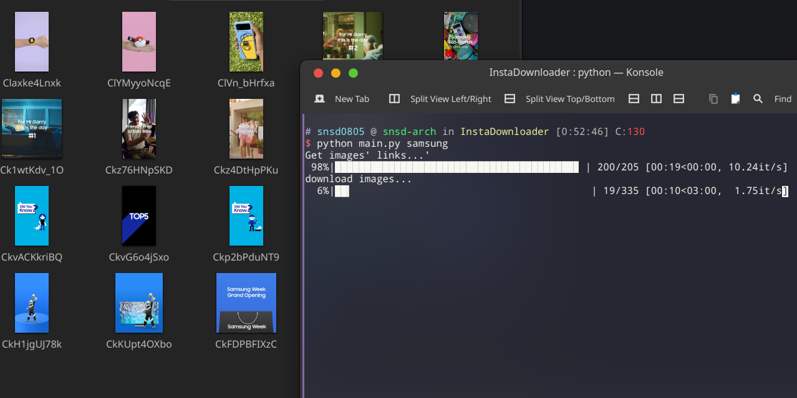
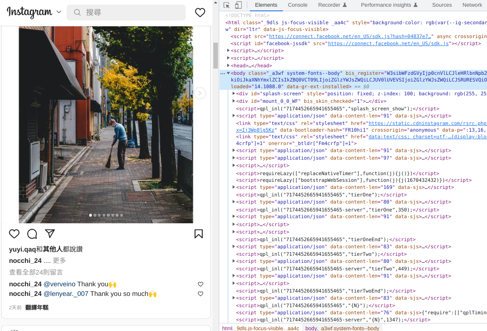
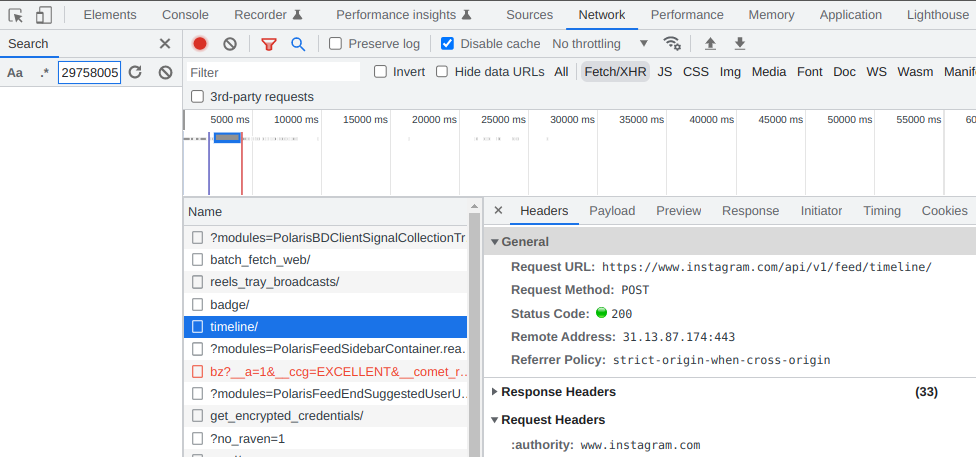
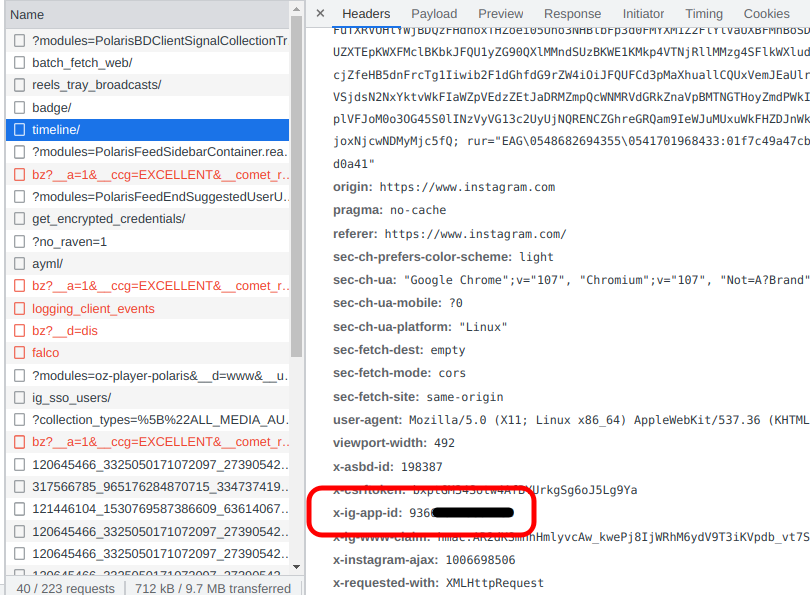
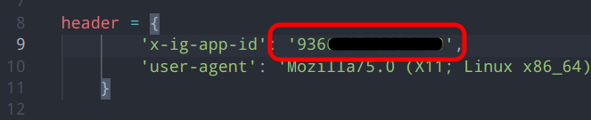
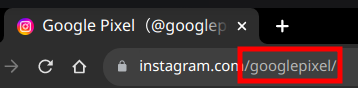
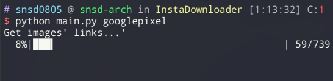
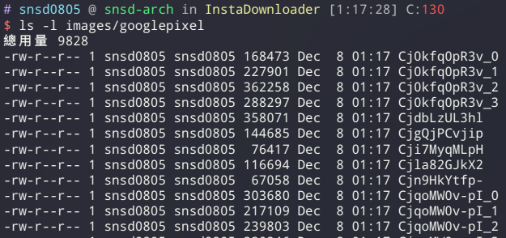

# InstaDownloader

A simple tool can help you download an Instagram (public) account's all pictures.


## Usage

1. download dependencies

    ```
    pip install requests tqdm
    ```

2. get IG app ID

    open you Instagram on your browser & open DevTool(F12)
    

    network -> select "timeline/"
    

    find "x-ig-app-id"
    

    paste to `main.py`
    

3. Start

    find username
    

    ```
    python main.py [username]
    ```
    

4. check

    find pictures in `./images/[username]`
    

> Please respect the intellectual property rights